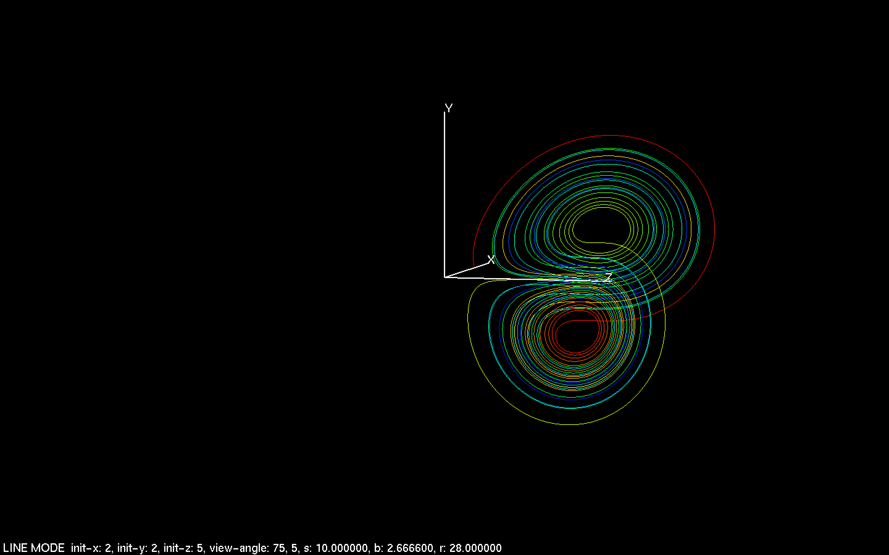
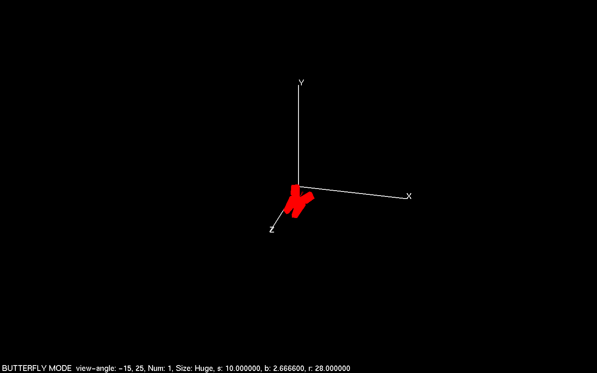
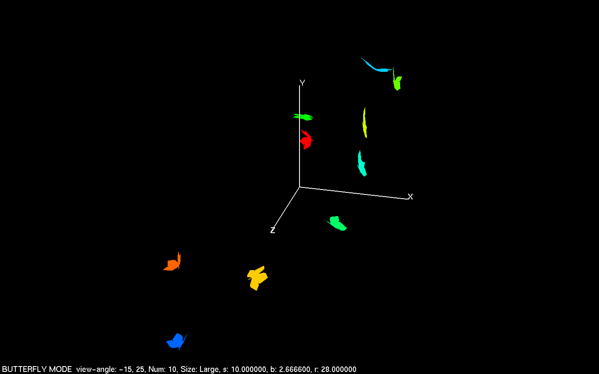
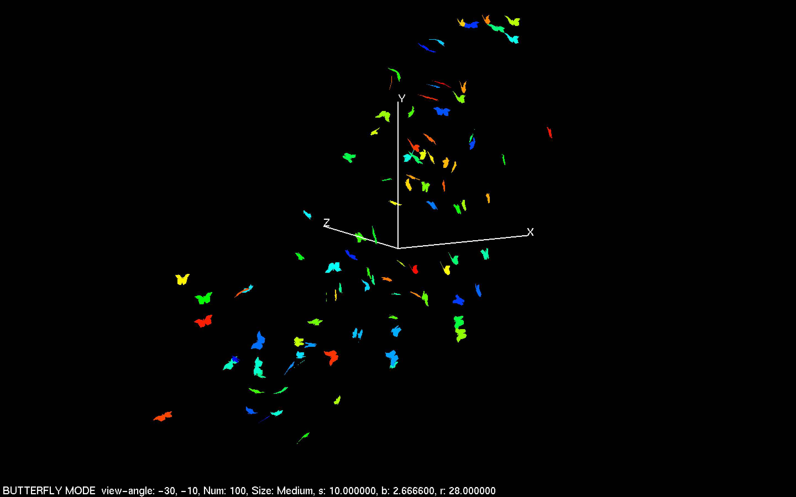
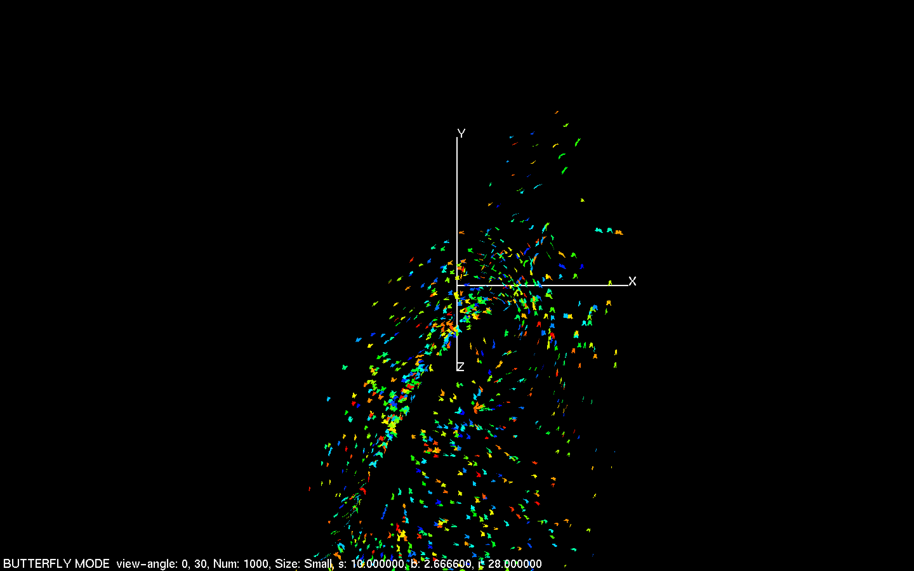

## About

#### This program is a visualization for the Lorenz attractor written in C using OpenGL

## Interesting Features

### Matrix Transformations

Multiple matrix transformations are used in order to rotate, scale, and translate both individual objects and the entire scene.

### Butterfly Data Structure

The butterflies are represented by an array of butterfly structs. Each butterfly consists of a forward directional vector, an upward directional vector, a position vector, and the angle between the wings and the body.

### Animations

In order to get the butterflies to flap their wings and follow a path, the program keeps track of the time in milliseconds since the last frame was rendered. This value is then used to update all of the butterflies on the screen before the scene is renderred again.

## Screenshots
#### Path of randomly spawned particle after 10,000 steps

#### One butterfly

#### Ten butterflies

#### 100 butterflies

#### 1,000 butterflies

#### 10,000 butterflies

