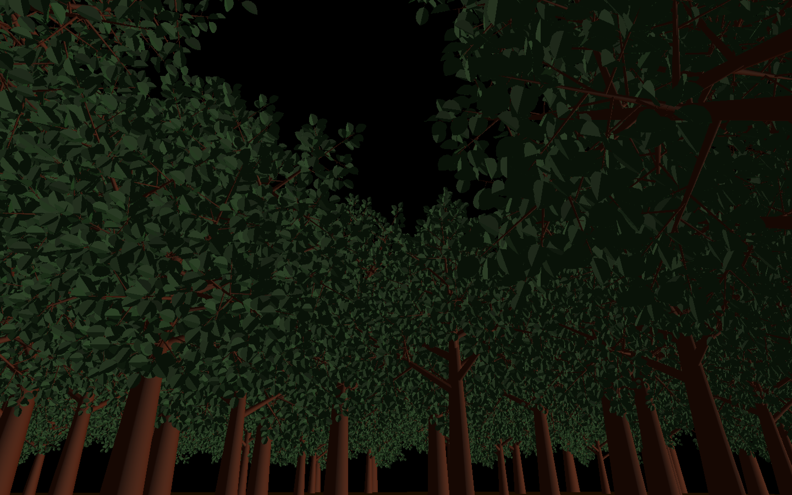
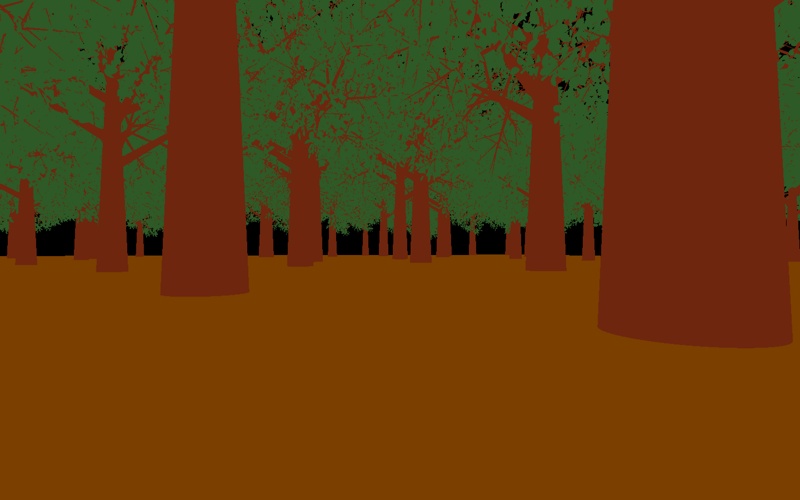
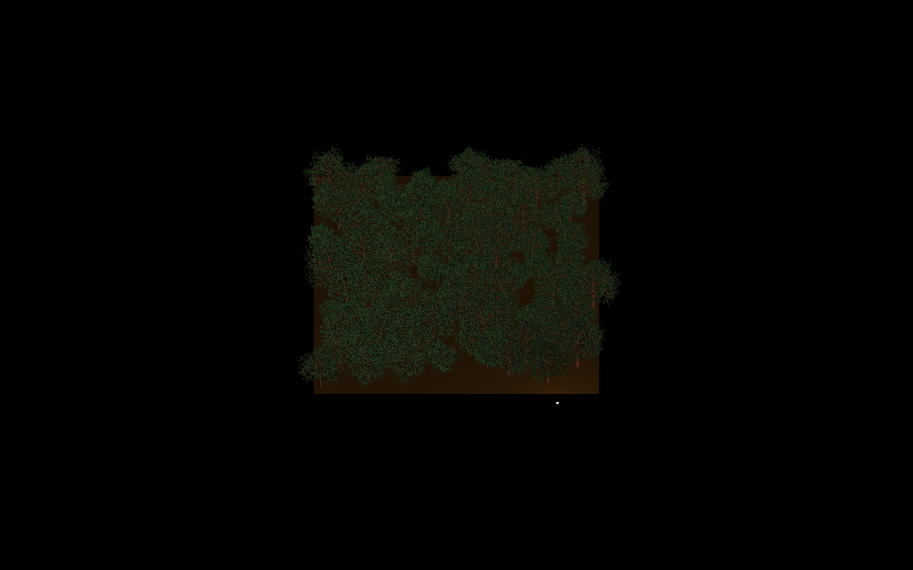
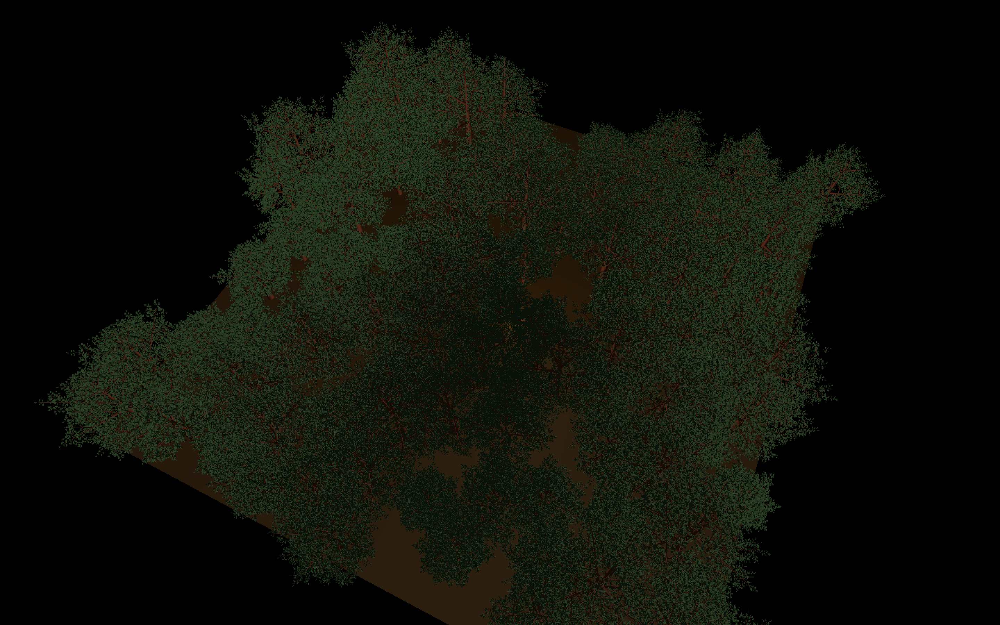

## About

#### This program procedurally generates a forest and allows the user to observe it in multiple projection and lighting modes

## Interesting Features

### "Tree" Data Structure

The trees in the forest are initially stored in a struct containing a position vector of the tree, an array of trunks, and an array of leaves. The components of the tree (the trunks and leaves) are stored with a position vector, an up vector, a vector orthogonal to up, a radius, and a height.

### Recursive Algorithm

The tree is generated using a recursive algorithm where each branch of the tree is a smaller tree. The base case adds a leaf. To call the recursive function on each branch, two unit vectors orthogonal to the current up vector are obtained, and then one of them is rotated around both the up vector and the other orthogonal vector using a transformation matrix. The rotated vector becomes the new up vector in the function call.

### Storing ~19 million triangles on the GPU

In order to get the program to render almost 20 million triangles with lighting calculations each frame, the vector representations of the trees are used to populate large arrays containing the vertices and surface normal vectors of the entire forest. To populaate these arrays, trunks and leaves are added using algorithms that convert the vector representations of the object into vertices and surface normals. To do so, the objects are "drawn" in terms of an orthonormal basis and then added to the array. These large arrays of vertices and normals are then passed on to a vertex buffer object which stores the data in the GPU memory for faster access and parallel computation.

## Screenshots

#### First person perspective with forward lighting

#### First person perspective with positional lighting

#### First person perspective with no lighting

#### Orthographic projection with positional lighting

#### Third person perspective with positional lighting

