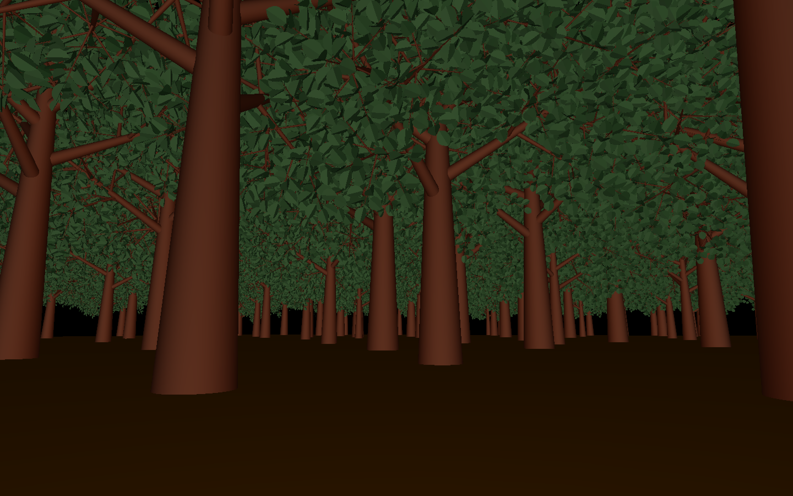
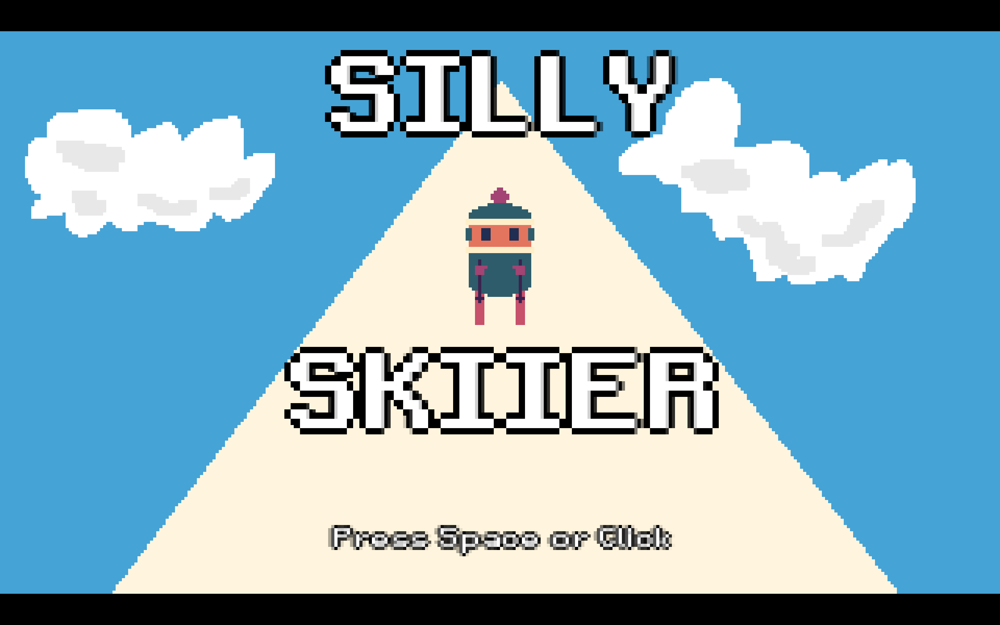
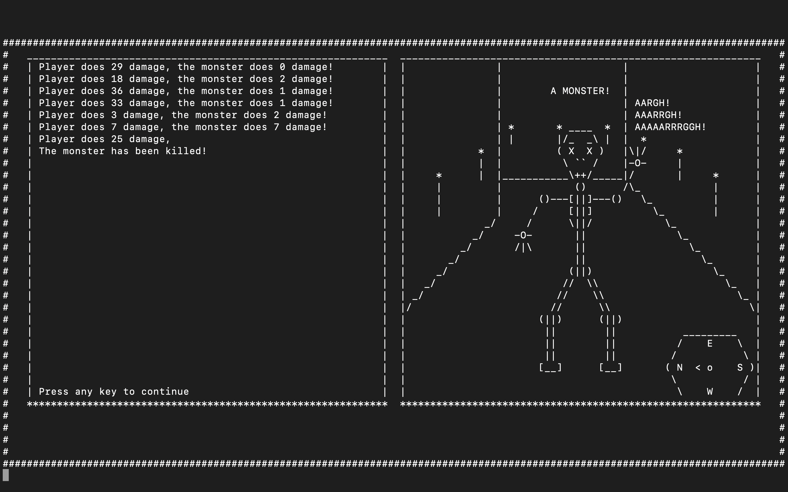
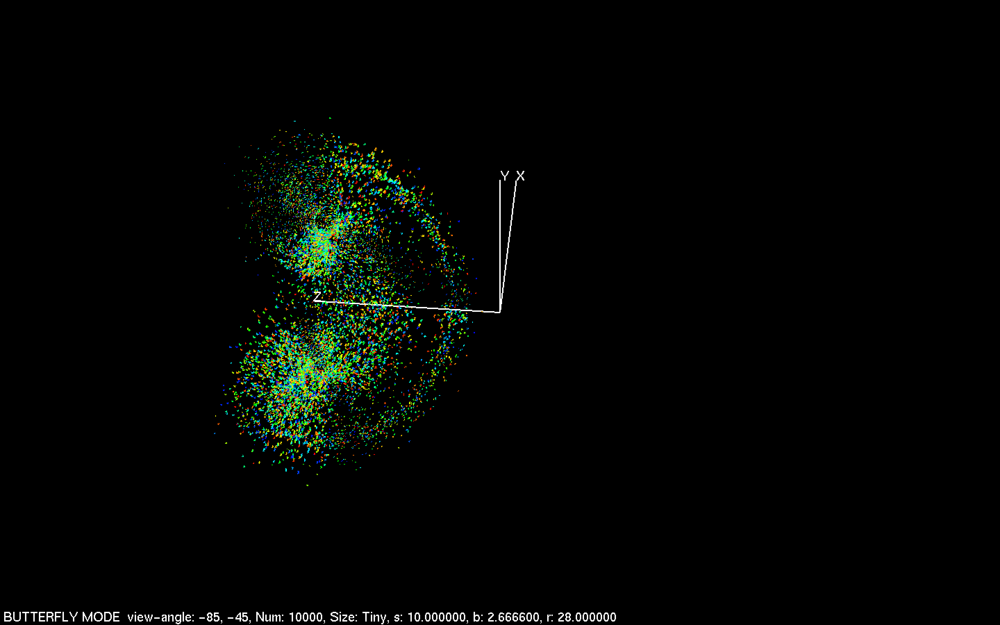

# There Are Four Projects In This Repository

## 1 - Procedurally Generated Forest - An OpenGL program written in C featuring a recursive algorithm that generates trees stored as 3d vectors

## 2 - Silly Skiier - A 2D pixel art skiing game made with lua and Love2D featuring simple one-click controls

## 3 - Maze RPG - A terminal based text adventure game written in C++ featuring a first person view made with string formatting

## 4 - Lorenz Attractor - An OpenGL program written in C featuring butterflies that fly along paths defined by the Lorenz equations

