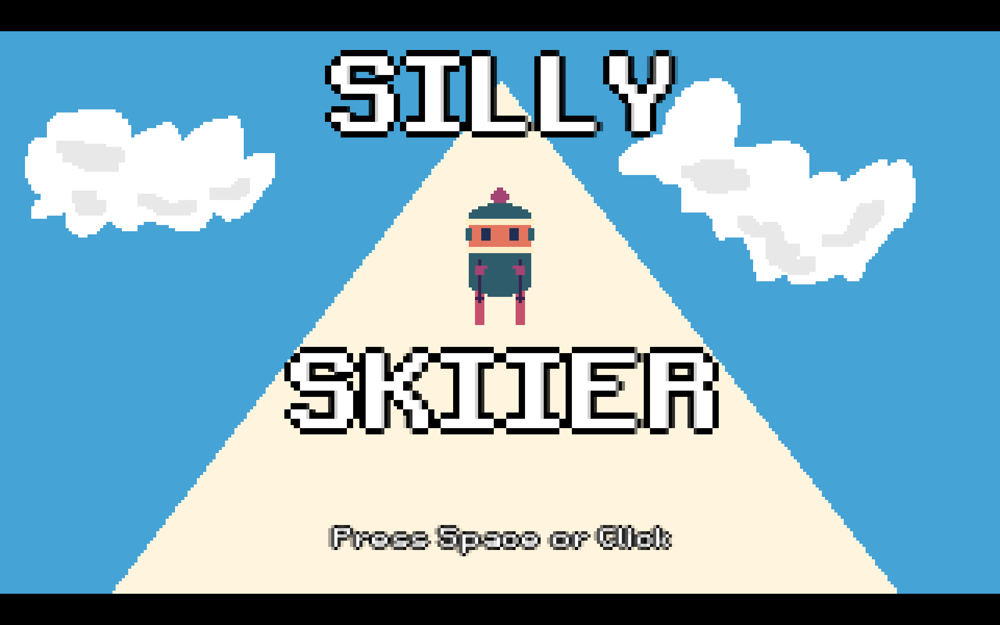

## About

#### Silly Skiier is a simple 2D pixel art game with one click controls and original artwork

## Interesting Features

### AABB collision detection

In order to detect collisions and transition to the fail state, each obstacle has a bounding box. A function cycles through an array of all on screen obstacles and ff the bounding box of the player overlaps with the bounding box of an obstacle, then a fail state is triggered and the player is brought to the awards screen.

### Ski trails

To draw the ski trails behind the skiier, every frame before the screen is updated a ski trail object is added at the position of the skiier. The entire screen is then shifted up before being redrawn. Once the trails have left the screen, they are deleted.

### State Machine

A state machine is used to transitio between states of the game. There is a title screen state that is entered on default, an animation state that transitions the game into a play state, a play state with game logic, and a score screen that displays information about the previous run.

## Screenshots

#### Title screen

#### Run start animation

#### Skiing through cluster of trees

#### Skiing around cluster of tree, rock, and snowman

#### Awarded a gold medal

