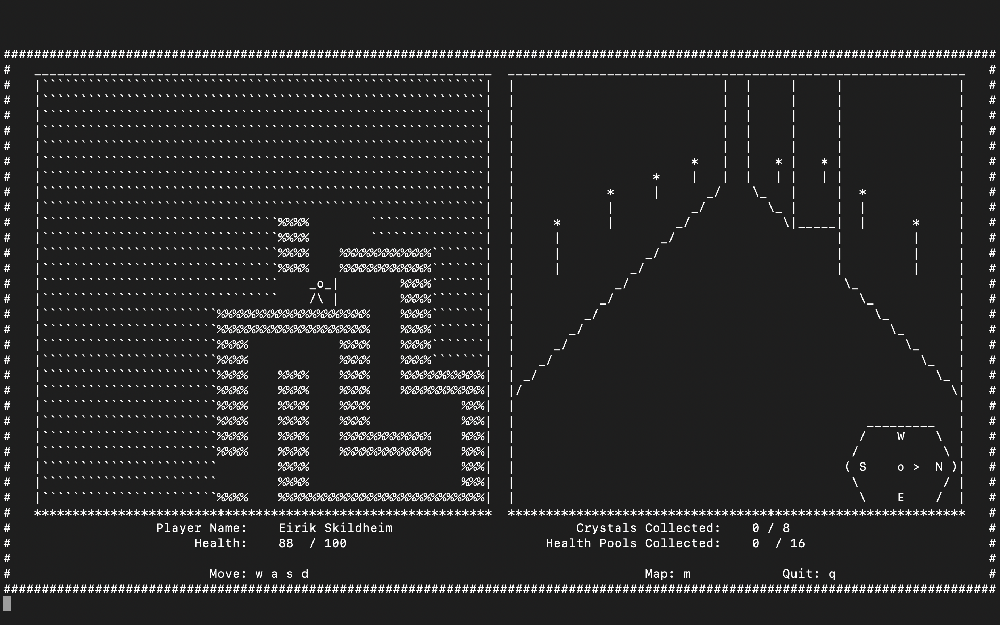
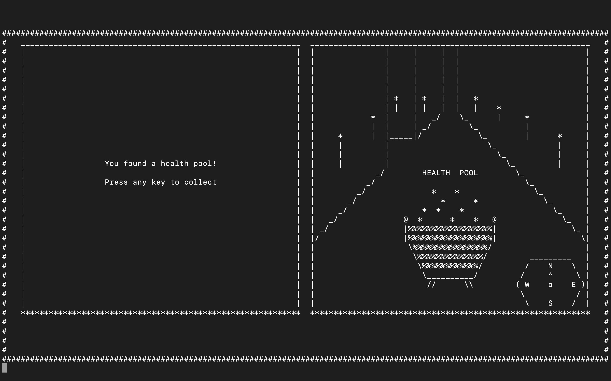
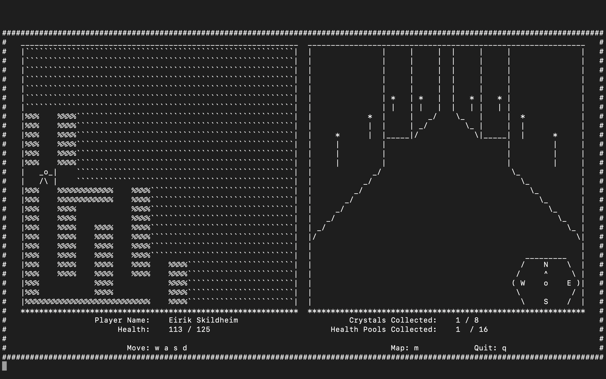
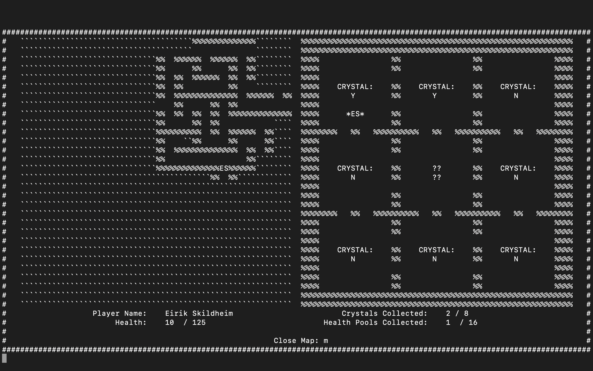

## About

#### Maze is a terminal based text adventure RPG featuring random maze generation, UI screen, and "first person view"

## Interesting Features

### UI and "First Person View"

The game has a UI that is drawn to the screen that includes information about your character's stats, their location, and a first person view of the maze. In order to draw the screen using only cout statements, each area of the screen is represented by a single string generated from some function, and then the characters are drawn in specific orders to produce the illusion of a UI and first person view.

### Object Oriented Design

The program is built using object oriented principles. The entire game is an instance of a game class, and all of the sections of the maze, monsters, players, etc are all classes contained within the game. Constructor and destructor functions are used in the generation of the maze, and all actions in the game are class methods.

### Random Maze Generation

In order to generate a unique maze every time, a random number generator is used with prebuilt maze pieces stored in a boolean array. The maze pieces are fitted together to form sections and then 9 sections form the overall maze. Power crystals and health pools are then randomly placed throught the maze.

## Screenshots

#### Main UI view

#### Collecting a power up

#### Battling a monster

#### Three way path split

#### Map screen

